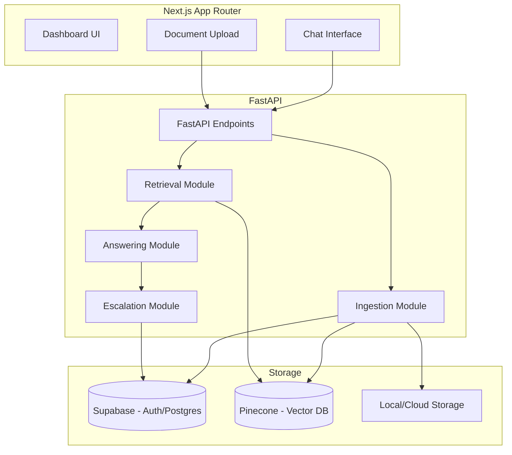
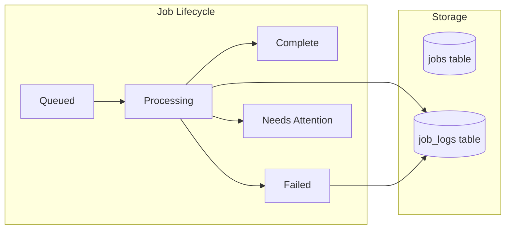

# System Architecture - Verified Digital Twin Brain

This document outlines the high-level architecture, data flows, and system components of the Verified Digital Twin Brain.

## High-Level Overview

The system is designed as a high-trust RAG (Retrieval-Augmented Generation) engine that enables users to interact with a "Digital Twin" backed by verified knowledge.

## Data Flows

### 1. Ingestion Pipeline
When a document is uploaded, it follows this path:
1. **Extraction**: Text is extracted from the PDF (currently via PyPDF2).
2. **Chunking**: Text is split into smaller, overlapping chunks.
3. **Embedding**: Each chunk is converted into a high-dimensional vector using OpenAI's `text-embedding-3-large`.
4. **Indexing**: Vectors and metadata (source ID, twin ID) are stored in Pinecone.
5. **Persistence**: Metadata about the source is stored in Supabase.

### 2. RAG Chat Flow
1. **Query Embedding**: The user's question is embedded using the same OpenAI model.
2. **Vector Search**: Pinecone retrieves the top-K most similar chunks, filtered by `twin_id`.
3. **Context Construction**: Chunks are assembled into a prompt for the LLM.
4. **Answer Generation**: GPT-4 generates an answer with citations.
5. **Confidence Scoring**: If retrieval scores are below a threshold (e.g., 0.7), an **Escalation** is created in Supabase for human review.

## Database Schema (Supabase)

The system uses the following core tables:
- `twins`: Settings and identity for each digital twin.
- `sources`: Metadata for ingested documents (PDFs, links, etc.).
- `conversations`: Chat sessions.
- `messages`: Individual user/assistant messages with confidence scores and citations.
- `escalations`: Flagged interactions requiring owner verification.

## Vector Schema (Pinecone)

- **Namespace**: Default (or per-twin if scaled).
- **Metadata**:
  - `twin_id`: UUID for multi-tenancy.
  - `source_id`: UUID of the original document.
  - `text`: The raw text chunk.

## Background Processing Foundation

The system includes a jobs and logs infrastructure for tracking long-running operations like document ingestion, reindexing, and health checks.

### Jobs Table
- Tracks job status, type, priority, and metadata
- Links to `twin_id` for ownership filtering
- Status: `queued`, `processing`, `complete`, `failed`, `needs_attention`
- Job types: `ingestion`, `reindex`, `health_check`, `other`

### Job Logs Table
- Immutable log entries per job
- Levels: `info`, `warning`, `error`
- Used for debugging and audit trail

### API Endpoints
- `GET /jobs` - List jobs (filtered by user's twins)
- `GET /jobs/{id}` - Get job details
- `GET /jobs/{id}/logs` - Get job logs
- `POST /jobs` - Create new job

### Frontend UI
- Dashboard page at `/dashboard/jobs`
- Read-only view of job status and logs
- Useful for monitoring ingestion progress

## Operational Documentation

See `docs/ops/` for:
- **AGENT_BRIEF.md** - How to operate in this repo
- **QUALITY_GATE.md** - Definition of done, tests, rollback
- **RUNBOOKS.md** - Troubleshooting guides
- **LEARNINGS_LOG.md** - Compounding ledger of lessons
- **ADR/** - Architecture decision records

